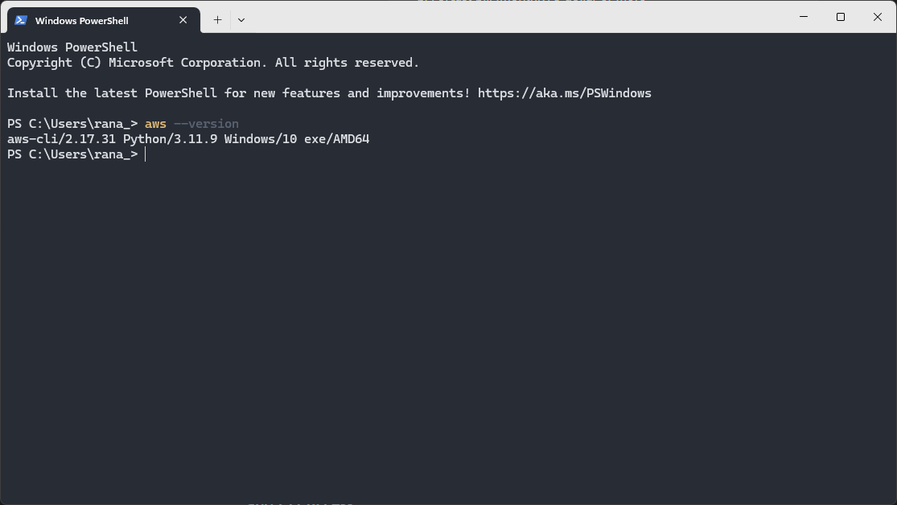

### 1. Install AWS CLI

#### Verify Installation:

```bash
aws --version
```



### 2. Create a New User `admin-yat` with Admin Access, Enable 2FA, Console, and CLI Access

#### Step 1: Create the User with Admin Access

```bash
aws iam create-user --user-name admin-yat
aws iam attach-user-policy --user-name admin-yat --policy-arn arn:aws:iam::aws:policy/AdministratorAccess
```

#### Step 2: Enable Console Access and Set Initial Password

```bash
aws iam create-login-profile --user-name admin-yat --password <initial-password> --password-reset-required
```

#### Step 3: Enable CLI Access (Generate Access Keys)

```bash
aws iam create-access-key --user-name admin-yat
```

**Note:** The response will include the `AccessKeyId` and `SecretAccessKey`. Store these securely, as they are necessary for CLI access.

#### Step 4: Enable 2FA (MFA)

```bash
aws iam create-virtual-mfa-device --virtual-mfa-device-name admin-yat-mfa
```

Then, associate the MFA device with the user:

```bash
aws iam enable-mfa-device --user-name admin-yat --serial-number arn:aws:iam::123456789012:mfa/admin-yat-mfa --authentication-code1 <MFA-code-1> --authentication-code2 <MFA-code-2>
```

#### Step 5: Test Connection

To test the connection using CLI:

```bash
aws configure
```

Use the Access Key ID and Secret Access Key provided earlier. After configuring, run a command like:

```bash
aws sts get-caller-identity
```

This should return details about the `admin-yat` user.

### 3. Create a New User `developer-yat` with Viewer Access on AWS EKS via CLI Only

#### Step 1: Create the User

```bash
aws iam create-user --user-name developer-yat
```

#### Step 2: Attach EKS Viewer Policy

```bash
aws iam attach-user-policy --user-name developer-yat --policy-arn arn:aws:iam::aws:policy/AmazonEKSReadOnlyAccess
```

#### Step 3: Create Access Keys (CLI Access Only)

```bash
aws iam create-access-key --user-name developer-yat
```

Again, securely store the `AccessKeyId` and `SecretAccessKey` provided in the response.

### 4. Create CloudWatch Alarms to Notify via Email

#### Step 1: Set Up SNS Topic for Notifications

Create an SNS Topic:

```bash
aws sns create-topic --name billing-alerts
```

Subscribe your email to the topic:

```bash
aws sns subscribe --topic-arn arn:aws:sns:<region>:<account-id>:billing-alerts --protocol email --notification-endpoint your-email@example.com
```

Confirm the subscription by checking your email.

#### Step 2: Create a CloudWatch Alarm for Current Bill

Create a CloudWatch Alarm for when the current bill exceeds $0.5:

```bash
aws cloudwatch put-metric-alarm --alarm-name "BillingAlarm-CurrentCost" --metric-name EstimatedCharges --namespace AWS/Billing --statistic Maximum --period 21600 --threshold 0.5 --comparison-operator GreaterThanOrEqualToThreshold --dimensions Name=Currency,Value=USD --evaluation-periods 1 --alarm-actions arn:aws:sns:<region>:<account-id>:billing-alerts --region us-east-1
```

#### Step 3: Create a CloudWatch Alarm for Forecasted Bill

Create a CloudWatch Alarm for when the forecasted bill exceeds $5:

```bash
aws cloudwatch put-metric-alarm --alarm-name "BillingAlarm-ForecastCost" --metric-name EstimatedCharges --namespace AWS/Billing --statistic Maximum --period 21600 --threshold 5 --comparison-operator GreaterThanOrEqualToThreshold --dimensions Name=Currency,Value=USD --evaluation-periods 1 --alarm-actions arn:aws:sns:<region>:<account-id>:billing-alerts --region us-east-1
```

### Final Notes

- Ensure you replace placeholders (`<region>`, `<account-id>`, `<MFA-code-1>`, etc.) with actual values.
- Ensure AWS Cost and Usage Report is enabled for accurate billing alarms.
- For more advanced scenarios, such as budgeting, AWS Budgets can be used instead of basic CloudWatch alarms.
